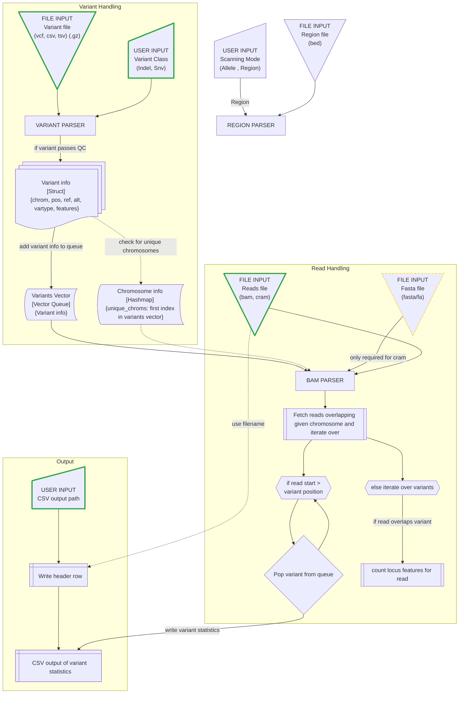
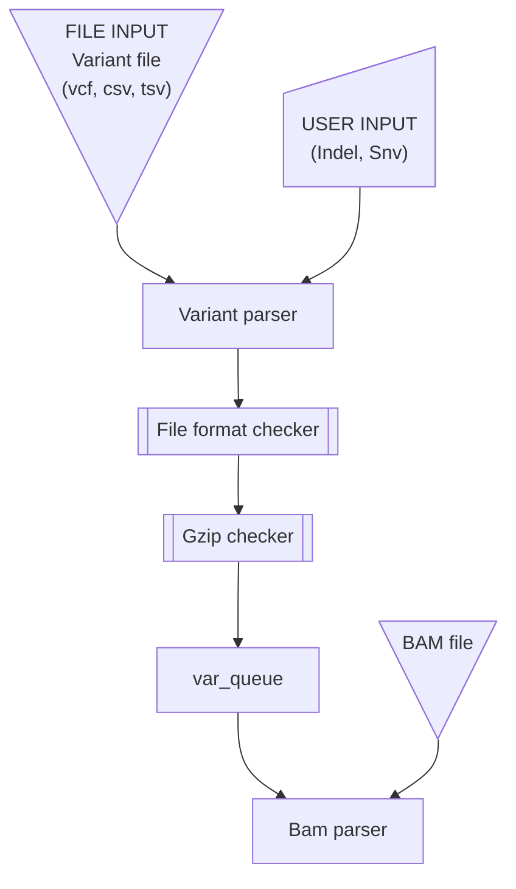

```mermaid
flowchart TD

    %% Define CSS classes for styling
    classDef required stroke:#28a745,stroke-width:3px;
    classDef optional stroke:#ffc107,stroke-width:1px,stroke-dasharray: 5 5;

    %% VARIANTS
    subgraph Variant Handling

    var_file:::required@{ shape: manual-file, label: "FILE INPUT \n Variant file \n (vcf, csv, tsv) (.gz)"}

    var_file --> var_parse@{ shape: rect, label: "VARIANT PARSER" }
    var_class:::required@{ shape: manual-input, label: "USER INPUT \n Variant Class \n (Indel, Snv)"} --> var_parse
    var_parse -->|if variant passes QC| variants@{ shape: docs, label: "Variant info \n [Struct] \n {chrom, pos, ref, alt, vartype, features}" }
    variants -.->|check for unique chromosomes| chrom_unique@{ shape: bow-rect, label: "Chromosome info \n [Hashmap] \n {unique_chroms: first index in variants vector}" }
    variants -- add variant info to queue--> var_queue@{ shape: bow-rect, label: "Variants Vector \n [Vector Queue] \n {Variant info}" }

    end

    %% TO BE IMPLEMENTED (SCANNING MODE)
    scanning_mode@{ shape: manual-input, label: "USER INPUT \n Scanning Mode \n (Allele , Region)"} -- Region --> region_parse@{ shape: rect, label: "REGION PARSER" }
    bed_file@{ shape: manual-file, label: "FILE INPUT \n Region file \n (bed)"}
    bed_file --> region_parse

    %% OUTPUT
    subgraph Output

    csv_filename:::required@{ shape: manual-input, label: "USER INPUT \n CSV output path" } --> write_header@{ shape: win-pane, label: "Write header row" }
    write_header --> variant_output@{ shape: win-pane, label: "CSV output of variant statistics" }

    end

    %% READS
    
    subgraph Read Handling

    var_queue --> bam_parse@{ shape: rect, label: "BAM PARSER"}
    chrom_unique -.-> bam_parse
    var_class@{ shape: manual-input, label: "USER INPUT \n Variant Class \n (Indel, Snv)"}

    reads_file:::required@{ shape: manual-file, label: "FILE INPUT \n Reads file \n (bam, cram)"}
    fasta_file:::optional@{ shape: manual-file, label: "FILE INPUT \n Fasta file \n (fasta/fa)"}

    fasta_file -->|only required for cram| bam_parse
    reads_file --> bam_parse
    bam_parse --> fetch_reads@{shape: subproc, label: "Fetch reads overlapping given chromosome and iterate over" }
    fetch_reads --> variant_conditional@{ shape: hex, label: "if read start > \n variant position" }
    variant_conditional --> remove_variant@{ shape: diamond, label: "Pop variant from queue" }
    remove_variant --> variant_conditional
    fetch_reads --> variant_iter@{ shape: hex, label: "else iterate over variants" }
    variant_iter -->|if read overlaps variant| count_features@{ shape: subproc, label: "count locus features for read" }

    end

    reads_file -.->|use filename| write_header
    remove_variant -->|write variant statistics| variant_output

```

EXPANDED VERSION

```mermaid
flowchart TD

    bam_file@{ shape: manual-file, label: "BAM file"}
    var_file@{ shape: manual-file, label: "FILE INPUT \n Variant file \n (vcf, csv, tsv)"}
    var_file --> var_parse@{ shape: rect, label: "Variant parser" }
    var_parse --> file_checker@{ shape: subproc, label: "File format checker" }
    file_checker --> gzip_checker@{ shape: subproc, label: "Gzip checker" }
    gzip_checker --> var_queue@{  }
    var_queue --> bam_parse@{ shape: rect, label: "Bam parser"}
    bam_file --> bam_parse
    mode@{ shape: manual-input, label: "USER INPUT \n (Indel, Snv)"} --> var_parse
```